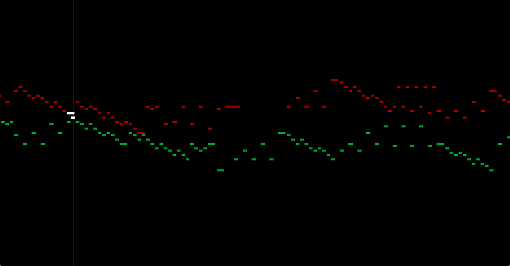

# Audio Synth

In this homework, you will build an audio synthesizer that plays and visualizes music.

 

This homework serves several learning goals:

- You’ll practice working with **many small, independent classes** in a heavily decomposed architecture. This whole assignment could be one unwieldy class! Instead, you will implement it using many small ones. (There are 15 classes and interfaces in the full solution, not counting tests.) This is typical of software projects that (1) have multiple collaborators and/or (2) are planning for growth — and it is the approach you should bring to your project.
- This assignment gives you a little more **practice with arrays and maps**.
- The homework helps you **keep your coding muscles limber** while you are in the design phase of your course project.
- Most importantly, the results are **fun**!

## Step 0: Understand your starting point

We have given you some starter code that provides the following building blocks for building your music synthesizer:

- `Signal`: a sound wave with a specific shape, amplitude, and frequency.
- `Waveform`: the _shape_ of a sound wave, independent of amplitude and frequency. You can ask a `Waveform` to generate a `Signal` at a specific frequency.
- `AudioBuffer`: an arbitrary sound that is made of many individual amplitude measurements. An `AudioBuffer` could potentially contain many different waveforms at different times. You can play an `AudioBuffer` to your computer’s speakers.

Here a more detailed explanation of each of these concepts:

### Signal

A “signal” is any quantity that varies over time. In the case of this program, the quantity that varies is the amplitude of a wave, and the signal represents sound.

A signal can be _any_ specific sound. If the sound is a wave, then it would be a wave with a specific amplitude and frequency. Each of these images depicts a different signal:

See the [`Signal`](src/audiosynth/Signal.java) interface for more information.

This simple interface is already complete; you won’t need to change it.

### Waveform

A “waveform” is the general _shape_ of a wave, independent of frequency, amplitude, or phase. For example:

- “sine wave” is a waveform, while
- “sine wave with amplitude 2 and wavelength 3” is a signal.

In this project, we given you a [`Waveform`](src/audiosynth/waveform/Waveform.java) interface with [several different implementations](src/audiosynth/waveform/). Each class that implements `Waveform` can generate signals for different wavelengths (and thus for different musical pitches):

These different `Waveform` implementations all compute the signal using a formula in a lambda expression, much like the graphing calculator activity.

These implementations are all already complete and correct. Note how small a useful class can be!

### AudioBuffer

In computer science, the word “buffer” means “place where we can temporarily store a bunch of data while we are working with it.” In this case, the buffer stores sound data.

Unlike the waveforms, which the code computes using mathematical formulas, an [`AudioBuffer`](src/audiosynth/AudioBuffer.java) contains **sampled audio:** arbitrary sound data expressed as specific numbers, in this case an array of floats. Each number in the array represents the amplitude at one moment in time, and the different array indices represent time steps of 1/48000th of a second. This is called **discrete sampling**.

This kind of sampled audio is how modern computers’ sound chips represent sound data. To play a signal as sound through your computer’s speakers, you must covert it to sample data:

The code in `AudioBuffer` is all correct, and the class is _almost_ complete; you will add just one method to it.

### Try it out!

We have given you a little code that renders just one signal to an `AudioBuffer`. Try running the `AudioSynth` class, and you should hear a sine tone through your computer’s speakers.

See if you can figure out how to change the:

- ✅ pitch,
- ✅ duration, and
- ✅ waveform.

## Understand your task

In earlier assignments, we gave you small class designs. In Breakout, you had to figure out a small class design on your own. In _this_ assignment, we give you a _large_ class design. And for your final project, you will have to figure out a large class design on your own.

Here is an overview of the tasks you will complete:

- Add a `mix()` method to `AudioBuffer` so you can combine many distinct notes into one piece of audio.
- Create an object model to represent a song made of many notes.
- Create code to render your song model to an `AudioBuffer`.
- Create a class to read song data from a file.
- Create a class to visualize your song model on the screen.

