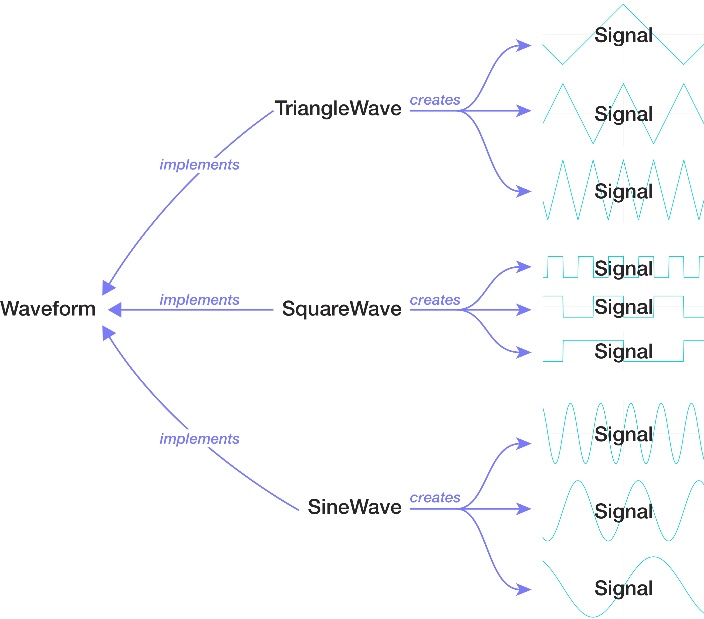

# Audio Synth

In this homework, you will build an audio synthesizer that plays and visualizes music.

 

This homework serves several learning goals:

- You’ll practice working with **many small, independent classes** in a heavily decomposed architecture. This whole assignment could be one unwieldy class, but instead you will implement it using many small ones. (There are 15 classes and interfaces in the full solution, not counting tests.) This is typical of software projects that (1) have multiple collaborators and/or (2) are planning for growth — and it is the approach you should bring to your project. How does this fit into the big picture of COMP 127?
    - In earlier assignments, we gave you small class designs.
    - In Breakout, you asked you to figure out a small class design on your own.
    - In _this_ assignment, we give you a _large_ class design.
    - For your final project, you will have to figure out a large class design on your own.
- This assignment gives you a little more **practice with arrays and maps**.
- The homework helps you **keep your coding muscles limber** while you are in the design phase of your course project.
- Most importantly, the results are **fun**!

## Terminology and starting point

We have given you some starter code that provides the following building blocks for building your music synthesizer:

- `Signal`: a sound wave with a specific shape, amplitude, and frequency.
- `Waveform`: the _shape_ of a sound wave, independent of amplitude and frequency. You can ask a `Waveform` to generate a `Signal` at a specific frequency.
- `AudioBuffer`: an arbitrary sound that is made of many individual amplitude measurements. An `AudioBuffer` could potentially contain many different waveforms at different times. You can play an `AudioBuffer` to your computer’s speakers.

Here a more detailed explanation of each of these concepts:

### Signal

A “signal” is any quantity that varies over time. In the case of this program, the quantity that varies is the amplitude of a wave, and the signal represents sound.

A signal can be _any_ specific sound. If the sound is a wave, then it would be a wave with a specific amplitude and frequency. Each of these images depicts a different signal:

See the [`Signal`](src/audiosynth/Signal.java) interface for more information.

This simple interface is already complete; you won’t need to change it.

### Waveform

A “waveform” is the general _shape_ of a wave, independent of frequency, amplitude, or phase. For example:

- “sine wave” is a waveform, while
- “sine wave with amplitude 2 and wavelength 3” is a signal.

In this project, we given you a [`Waveform`](src/audiosynth/waveform/Waveform.java) interface with [several different implementations](src/audiosynth/waveform/). Each class that implements `Waveform` can generate signals for different wavelengths (and thus for different musical pitches):

These different `Waveform` implementations all compute the signal using a formula in a lambda expression, much like the graphing calculator activity.

These implementations are all already complete and correct. Note how small a useful class can be!

### AudioBuffer

In computer science, the word “buffer” means “place where we can temporarily store a bunch of data while we are working with it.” In this case, the buffer stores sound data.

Unlike the waveforms, which the code computes using mathematical formulas, an [`AudioBuffer`](src/audiosynth/AudioBuffer.java) contains **sampled audio:** arbitrary sound data expressed as specific numbers, in this case an array of floats. Each number in the array represents the amplitude at one moment in time, and the different array indices represent time steps of 1/48000th of a second. This is called **discrete sampling**.

This kind of sampled audio is how modern computers’ sound chips represent sound data. To play a signal as sound through your computer’s speakers, you must convert it to sample data:

The code in `AudioBuffer` is all correct, and the class is _almost_ complete; you will add just one method to it.

### Try it out!

We have given you a little code that renders just one signal to an `AudioBuffer`. Try running the `AudioSynth` class, and you should hear a sine tone through your computer’s speakers.

See if you can figure out how to change the:

- ✅ pitch,
- ✅ duration, and
- ✅ waveform.

## Your tasks

For this assignment, please work through the following list of guided tasks:

- [**Mixing**](doc/specification/00_mix.md): Add the ability to combine many distinct signals into one piece of audio.
- [**Song model**](doc/specification/01_song_model.md): Create an object model to represent a song made of many notes.
- [**Song audio rendering**](doc/specification/02_render_audio.md): Create code to render your song model to an `AudioBuffer` so you can hear it.
- [**Read song files**](doc/specification/03_song_reader.md): Create a class to read song data from a file. After this step, you can hear the songs!

Extra credit challenges:

- [**Visualization**](doc/specification/04_visualization.md): Create a class to visualize songs on the screen.
- [**Animation**](doc/specification/05_animation.md): Make the music scroll as it plays.
- [**Note highlighting**](doc/specification/06_highlight.md): Highlight the currently playing notes. A little tricky, but it looks _awesome!_

Each task gives you the outline of a class structure, some hints, and some tests. 🚨 **Do not neglect the tests!** 🚨 Be sure to run the tests each step gives you and make sure they pass before moving on to the next step.

Note that the main point of this assignment is to give you the feeling of working with and building out an object model with many moving parts. The point is _not_ to confuse you with tricky directions! If you look at any of the of the classes and methods described in the steps above and think to yourself, “What does that mean?!,” **please ask for clarification right away.**

Enjoy! 🎵
