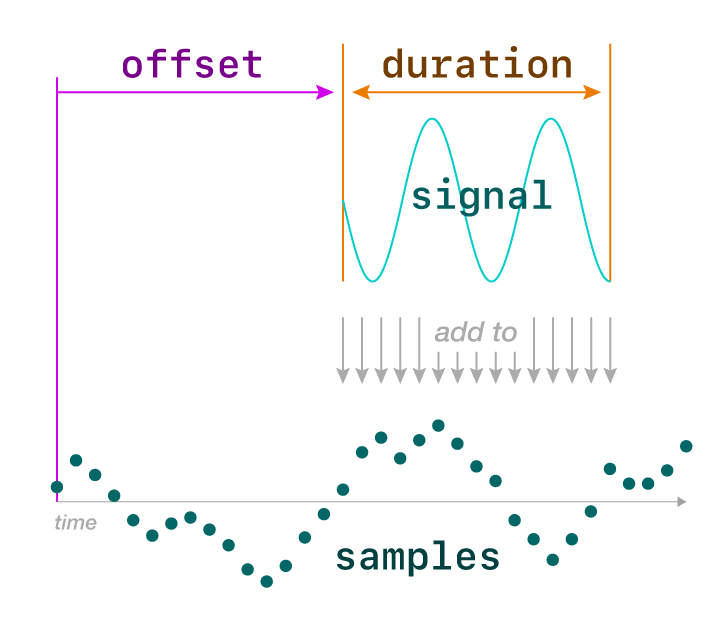

# Part 1: Implement `AudioBuffer.mix()`

Your goal: modify `AudioBuffer` so that you can mix in slices of different signals. You will use this to combine many notes into one song.

In this context, “mix” means ”add together different audio signals.” Here “add” means simple numerical addition, nothing more! When add together audio aignals, your brain will generally perceive this as multiple sounds playing at the same time. Adding together audio signals for notes thus creates harmony!


## New `AudioBuffer` method

Here is the Javadoc and the method signature for a new method you are going to add to the
`AudioBuffer` class:

```java
/**
 * Renders a slice of the given signal into this audio buffer, adding new values from the signal to
 * the sample values already present in the buffer.
 *
 * @param signal    A sound source.
 * @param offset    The distance in samples from the start of the audio buffer at which to start
 *                  adding values from the signal. At this position, the new signal has t=0.
 * @param duration  The number of samples of the signal to add to the buffer. The offset +
 *                  duration must not exceed the length of the buffer.
 * @throws IllegalArgumentException If the offset or duration extend outside the bounds of this
 *                  buffer.
 */
public void mix(Signal signal, int offset, int duration)
```

Read that text carefully. Try to picture it. What are the parameters? What does each parameter mean? Can you visualize what it does?

Reading specifications like this **with extraordinary care** is part of software development. This is often true even in situations where you, the developer, are not an expert in the software’s subject matter, do not have all the vocabulary, and are unsure about the context. Software development frequently requires gaining just enough understanding of a problem to write working code.

Practice those close reading skills now. Once you think you have some understanding of the text above, check yourself against this diagram:

<details>
  <summary>(Click for visualization of this method)</summary>

  [](images/mix.pdf)  
</details>

Once you understand what this method is supposed to do — and **only** when you do! — copy and paste the code above (including the Javadoc!) into the `AudioBuffer` class to get started, then implement the method according to what the documentation describes.


## Handling out-of-bounds errors

Note that the text above says that the method should give an error if `offset` or `duration` is out of bounds. Here is the code to use to generate the appropriate error when they are:

```java
throw new IllegalArgumentException("input signal is out of bounds");
```

Ensure that your bounds check has **failure atomicity**: if there is illegal argument error,
then the buffer should not be modified at all, not even the samples that would be in bounds.

<details>
  <summary>(How should I achieve failure atomicity?)</summary>

  Check whether the offset and duration will fall out of bounds _before_ you start modifying the array.
</details>


## A big hint!

Implementing the `mix` method **does not require very much code**. A working implementation is typically 3 or 4 lines for the bounds check, and 3 or 4 lines for the actual mixing.

The hard part of writing this method is that you have to get every little detail exactly correct. That means understanding the problem, understanding the corner cases, understanding the existing code in the `AudioBuffer` class, and understanding Java arrays.

Generating code is by far the easiest part of programming. The hard part is understanding what you’re doing, and making good decisions about what to do, so that the code you generate actually helps.


## Tests to add

Add the following tests to `AudioBufferTest`. Take a moment to study each one. Do you understand (1) what the code does, and (2) what particular condition it is testing?

```java
@Test
void mixAddsToExistingSignal() {
    audio.getSamples()[4] = 100;
    audio.mix(n -> 1, 2, 4);
    assertArrayEquals(
        new float[] { 0, 0, 1, 1, 101, 1, 0, 0 },
        audio.getSamples());
}

@Test
void mixStartsSignalAtTime0() {
    audio.mix(n -> n + 10, 4, 3);
    assertArrayEquals(
        new float[] { 0, 0, 0, 0, 10, 11, 12, 0 },
        audio.getSamples());
}

@Test
void mixCatchesOutOfBoundsErrors() {
    assertThrows(IllegalArgumentException.class, () -> {
        audio.mix(n -> 100, -1, 1);
    });
    assertThrows(IllegalArgumentException.class, () -> {
        audio.mix(n -> 100, 7, 2);
    });

    // Buffer should be unmodified if params were illegal
    assertArrayEquals(
        new float[] { 0, 0, 0, 0, 0, 0, 0, 0 },
        audio.getSamples());
}

@Test
void mixReachesBothEnds() {
    audio.mix(n -> 1, 0, 8);
    audio.mix(n -> 10, 0, 3);
    audio.mix(n -> 100, 5, 3);
    assertArrayEquals(
        new float[] { 11, 11, 11, 1, 1, 101, 101, 101 },
        audio.getSamples());
}

@Test
void mixMultiple() {
    audio.mix(n -> n * 0.5 + 1, 4, 3);
    assertArrayEquals(
        new float[] { 0, 0, 0, 0, 1.0f, 1.5f, 2.0f, 0 },
        audio.getSamples());

    audio.mix(n -> n - 6, 1, 5);
    assertArrayEquals(
        new float[] { 0, -6, -5, -4, -2, -0.5f, 2.0f, 0 },
        audio.getSamples());
}
```

These tests should pass if you implemented `mix()` correctly.

Next: [Render audio](2_render_audio.md)
